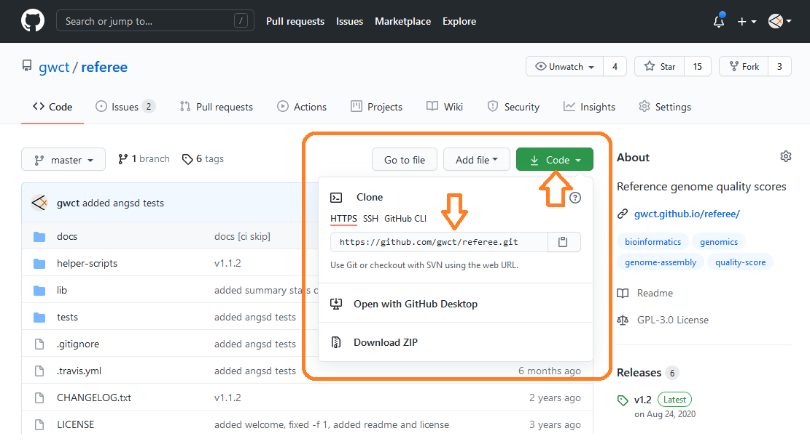
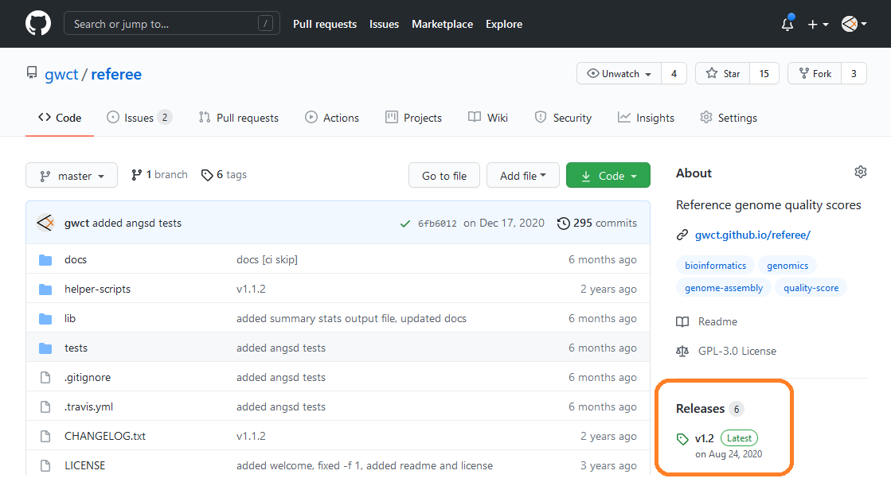
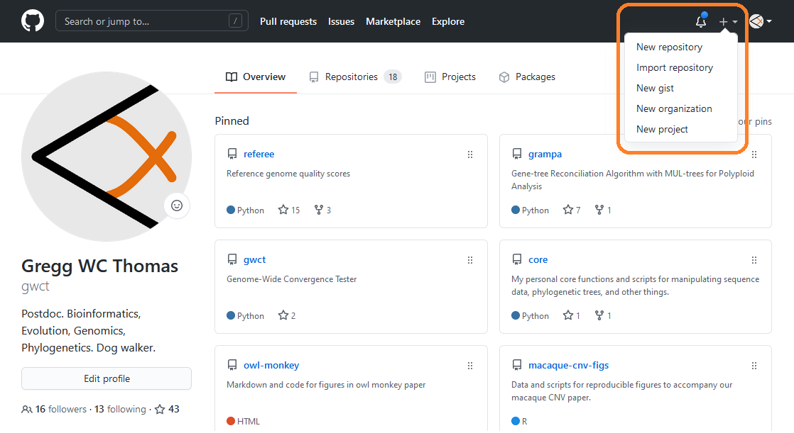
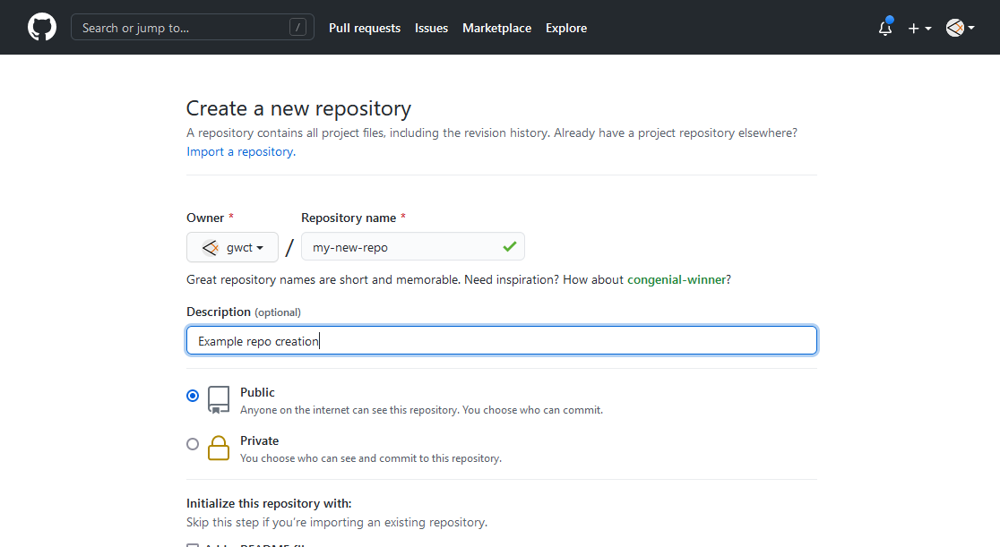
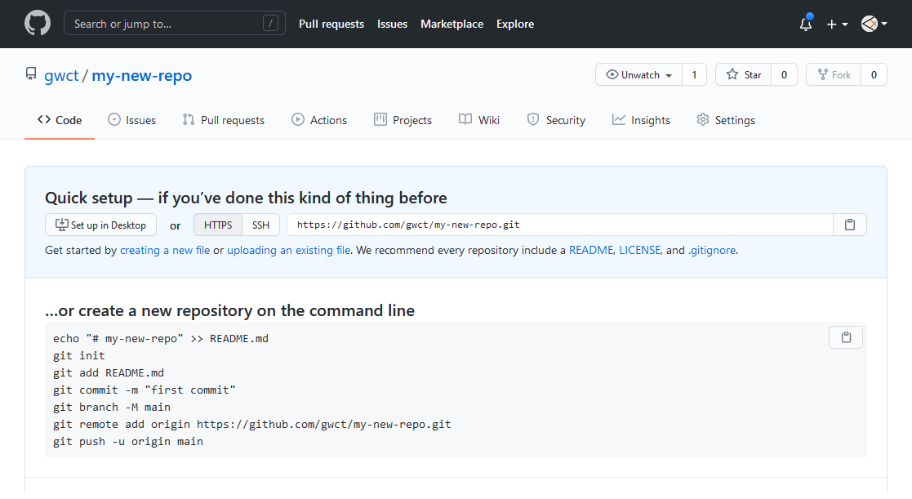
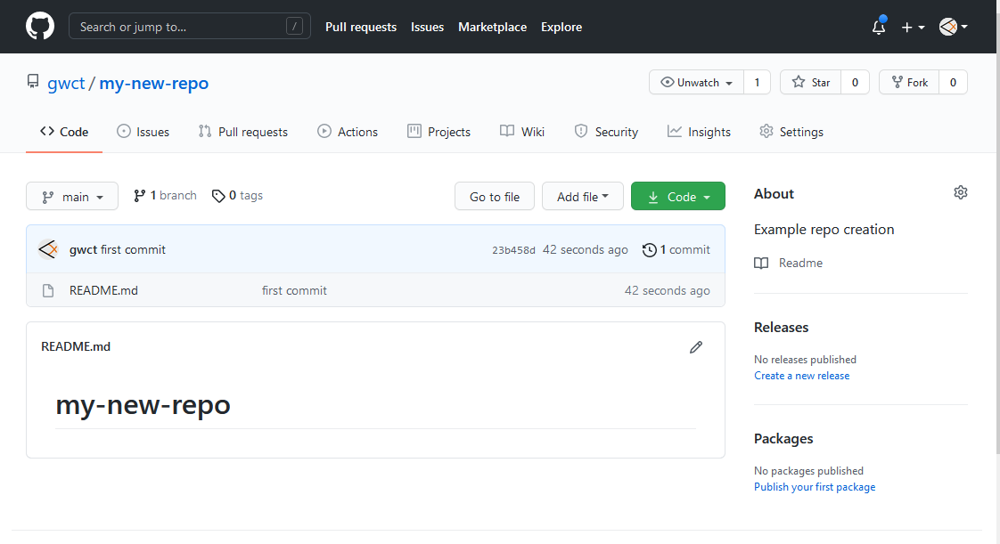

# git basics

### Author: Gregg Thomas

---

git is a system for version control of software. what that means is that it keeps track of changes you make to your code or documents and allows you to sync them between users and machines. This can be somewhat confusing if you mess up the syncing order between machines, but can be a really powerful tool for reproducibility.

There are plenty of guides out there for basic git usage, but I thought I would put together some relevant points for us here.

# Table of Contents

- [Glossary](#git-jargon-and-definitions)
- [Installating git](#installing-git)
- [Basic git usage](#basic-git-usage)
    - [Cloning a repository](#cloning-a-repository)
    - [Downloading a release](#downloading-a-release)
    - [Creating your own repository](#creating-your-own-repository)
        - [Creating the repository on github](#creating-the-repository-on-github)
        - [Initializing the repository locally](#initializing-the-repository-locally)
    - [Pushing changes to your repository](#pushing-changes-to-your-repository)

---

## git jargon and definitions

---

Here is a table with some common phrases you'll hear people use when talking about git and github along with their definitions.

| Term | Definition |
| ---- | ---------- |
| repository/repo | Any given project on github or on a local machine. In essence, just a folder and all of it's subfolders and files for a particular project. |
| clone | A copy of a repository / the process of copying a repository. |
| fork | A copy of a repository between users. |
| branch | A copy of a repository from a certain point within that repository. |
| pull | The process of integrating changes from one version of a repository to another. There are two general use cases. 1) When the owner of a repository makes changes to it, you pull those changes into your local copy. 2) When you make changes to a forked repository and want the owner of the original to incorporate them, you initiate a pull request, and then the owner can pull those changes in. |
| staging area | When you change or add new files to a repository, they are first added to an intermediate staging area where they can be reviewed. |
| add | The process of adding new/changed files to the staging area. |
| commit | The process of adding new/changed files in the staging area to the repository. |
| push | The process of uploading changes from a local repository to the one stored on github |

## Installing git

---

To use github, you will need to install the git software on your machine. You can find instructions on how to do so [here](https://git-scm.com/downloads).

While git ships with a graphical interface, this guide focuses on using git through the command line interface.

## Basic git usage

---

### Cloning a repository

In it's most basic sense, git allows you to use software developed by others. Let's say you need some piece of software for a project, and the developers of this software keep it on github in a repository. To get a copy of this software on your computer, you can **clone** it. First, navigate to the repo in your web browser and click on the green code button in the top right. This will bring up a link to the repository of the format: `https://github.com/<git user>/<repository name>.git`:



Copy this link and open your command prompt and type:

```
git clone https://github.com/<git user>/<repository name>.git
```

This will create a folder on your computer called `<repository name>`. You can now follow the instructions on how to use the software, hopefully by following the documentation provided for it.

Note that this will create the folder in whichever directory you are in your command prompt. If you wish to clone this repository (create this directory) in a different folder, simply navigate their first.

### Updating a cloned repository

If the developers make changes to the repository you have cloned, you can easily integrate these changes into your local copy by **pull**ing them. Simply navigate to the repository from your command prompt (e.g. cd /path/to/repo/), and when you are inside the repository directory type:

```
git pull
```

This should automatically download the updated files.

### Downloading a release

Some software developers keep a well-tested version of their software available as a **release**. You can download this directly from the repository by clicking on the Releases link on the right:



Note that releases are unlinked to the git repository. They are just a snapshot of the software at a given point in time. To update a release you will have to manually download and install the next release.

## Creating your own repository

If you have a set of scripts, software, or files from a given project that you want to keep backed up and/or share with others, a git repository is a great solution. Creating a repository has two parts. 1) Creating the repository on the github web interface and 2) initializing the folder on your local machine for the repository and uploading files.

### Creating the repository on github

Navigate to your github user page and click on the **+** icon in the top right. This will bring up a menu where you can click on **New Repository**:



This will bring up a page where you can set up your repository with a name, description, and other basic things like a licsense or a readme file. 



I usually provide a name and a description and leave everything else as is.

Once you're ready, click the green **Create repository** button at the bottom of the page. This will take you to your repository page. However, there are no files in your repo yet, and you still need to set it up on your local machine. Luckily, github provides some easy instructions on this page for how to do so:



### Initializing the repository locally

There are several options for ways to set this up, but I usually stick with the **..or create a new repository on the command line** instructions. The commands are provided on the screen, but there are a couple of things we may want to do first. Switch to your command line interface and navigate to the location where you want to create your repository:

```
cd /desired/path/to/repo/
```

Next, create a folder here with the name of your repository. In my case for this example it would be:

```
mkdir my-new-repo
```

Enter that repository:

```
cd my-new-repo
```

And we are now ready to execute the commands from the github page.

1) Create a file in the new repository:

```
echo "# my-new-repo" >> README.md
```

This simply creates the README.md file as the first file in the directory. Note if you already have local files you know you want to upload, you can move them into the directory now as well. If you already have a README.md file, skip this step.

2) Initialize the repository:

```
git init
```

This just adds all the setup and config files that git uses to track changes between copies and versions of the repo. You may notice the `.git` folder is created. You can ignore this, but don't delete it. It contains the history of the repo.

3) Add local files to the staging area:

```
git add README.md
```

This tells git you want to incorporate the changes in this file to the history of the repository.

Note that if you added more files to the folder you will want to run:

```
git add -A
```

This will add ALL changed files to the staging area.

4) Commit the stages in the staging area:

```
git commit -m 'first commit'
```

This moves the changes from the staging area to the local repository history. Always provied a useful `-m`essage for each commit for the history of the repo. 

Note that while the changes are now fully incorporated into your local copy of the repository, there are a couple other things before they are uploaded or **push**ed to the remote one.

5) Setting up the first branch:

```
git -M main
```

This moves us to the main branch of the repo.

6) Adding the location of the remote repository:

```
git remote add origin https://github.com/<github user>/<github repo>.git
```

7) We are now ready to **push** our changes to the remote repository:

```
git push -u origin main
```

This will upload all changes to the main branch of the remote repository using the origin linke we set up in step 6.

Now, you should be able to refresh the repository page on github and see your files there.



## Pushing changes to your repository

You are now free to make any changes or add any files to your local repository folder. You can check the status of all changes in your repository by typing:

```
git status
```

This can be helpful to keep track of what would be added or committed at any given point.

When you are ready to upload the changes to the remote repository, the steps are a simplified version of what is outlined above when you created your repository. Basically, you just **add**, **commit**, and then **push** your changes. There's no need to initialize or setup a remote link anymore since we have already done that!

1) Add your changed files to the staging area:

```
git add -A
```

Note that `-A` adds **all** new or modified files to the staging area. If you only want to add specific files you can do that too:

```
git add file1 file2
```

2) Commit the changed files to the local repository

```
git commit -m 'fixed bug X'
```

This will move the changed files from the staging area to the local repository history. Remember to add a useful `-m`essage describing the purpose of these changes.

Now that these files have been committed, they will no longer appear when checking the `git status`. They are officially a part of the local repository history now.

3) Upload/**push** the local repository to the remote repository:

```
git push -u origin main
```

This updates the remote repository with all the changes you've committed locally. Be sure to specify which remote link (origin) and which branch (main) to use.